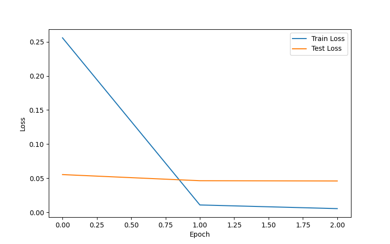
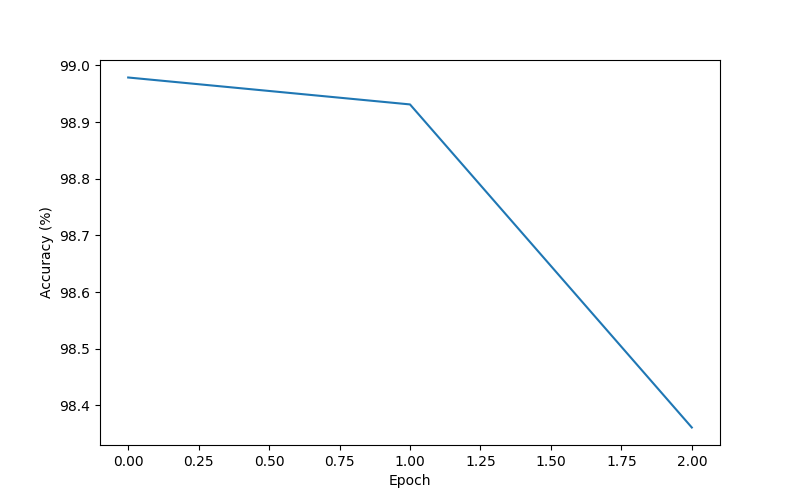

# 🚦 Traffic Sign Recognition using Deep Learning

A deep learning project for classifying German Traffic Signs (GTSRB) using both a custom Convolutional Neural Network (CNN) and Transfer Learning with ResNet18.

## 📌 Project Overview

This project aims to accurately classify traffic signs into one of 43 categories using image classification techniques.

Two models were implemented and compared:

- Custom CNN (built from scratch using PyTorch)
- ResNet18 (Transfer Learning)

The comparison demonstrates the effectiveness of transfer learning over a custom CNN for traffic sign recognition.

---

## 📂 Dataset

**German Traffic Sign Recognition Benchmark (GTSRB)**

- 43 traffic sign classes
- RGB Images
- Image size: 32 × 32

---

## 🛠 Technologies Used

- Python
- PyTorch
- Torchvision
- NumPy
- Matplotlib
- Google Colab

---

## 🧠 Models Implemented

### 1. Custom CNN

Architecture:
- Conv2D
- ReLU
- MaxPool
- Conv2D
- ReLU
- MaxPool
- Fully Connected Layer

### 2. ResNet18 (Transfer Learning)

- Pretrained on ImageNet
- Final classification layer modified for 43 traffic sign classes
- Fine-tuned using Adam optimizer

---

## 📊 Results

| Model | Test Accuracy |
|--------|--------------:|
| Custom CNN | **84.45%** |
| ResNet18 (Transfer Learning) | **98.65%** |

---

## 📈 Training Curves

### ResNet18 Loss Curve



### ResNet18 Accuracy Curve



---

## 🚀 How to Run

Clone the repository

```bash
git clone https://github.com/harikrishnamunagala-hub/Traffic-Sign-Recognition.git
```

Install dependencies

```bash
pip install -r requirements.txt
```

Run the notebook

```
Traffic_Sign_Recognition.ipynb
```

---

## 📁 Repository Structure

```
Traffic-Sign-Recognition/
│
├── Traffic_Sign_Recognition.ipynb
├── resnet18_gtsrb.pth
├── requirements.txt
├── loss_curve_resnet.png
├── accuracy_curve_resnet.png
└── README.md
```

---

## 🎯 Future Improvements

- Mobile deployment using TensorFlow Lite
- Real-time traffic sign detection using OpenCV
- Hyperparameter optimization
- Model quantization for edge devices
